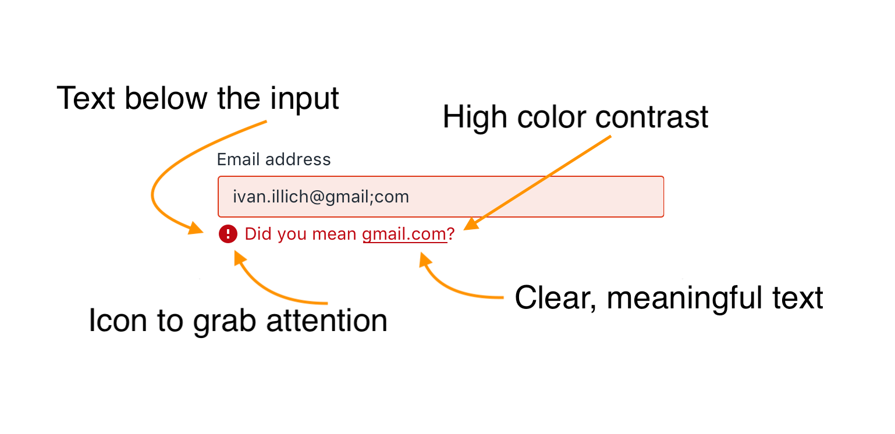
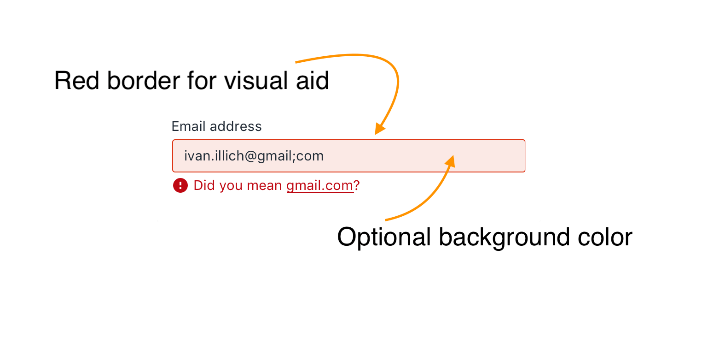
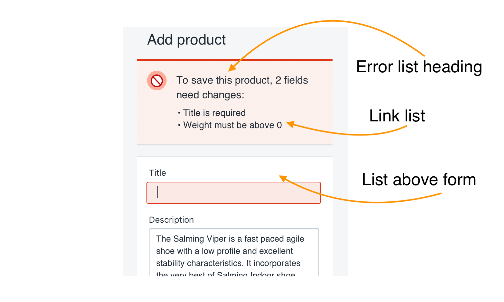

# Form design

Online forms are the foundation of communication in the modern age. Without forms, all we'd have would be static text websites with pictures of cats to look at. Sure, it doesn't sound too bad, but without forms, how would we discuss and share cat pictures with all our friends and family? How about shopping online, booking a flight, ordering pizza late at night, or setting up a time to meet on that dating site?

This is why well-written form structure and design is critical to the success of any web form.

Let's take a look at a few areas on how we can increase accessibility when it comes to form design.

## Labels

Having highly visible, clear, and precise form `label`s is critical to the success of anyone being able to fill out a form. Without a `label`, no one would know what the intended purpose for each form field would be!

Let's look at a few design considerations when adding `label`s to our forms.

### Placeholders

- 👎 Unable to convey the purpose of the `input` by screen readers
- 👎 Placeholder text is removed from view when typing
- 👎 May look like text has been entered

> Give the [Placeholder demo](https://codepen.io/svinkle/full/VdgrZr/) a try.

HTML form fields feature an attribute called `placeholder`. The value of the attribute places text inside the field and when someone starts to type, the placeholder text is automatically removed.

The original purpose of this attribute is to place helper or hint text inside the `input`. However, sometimes placeholders are being used in place of an actual HTML `label` element. This is problematic for a few reasons:

- Without a `label` element associated with the `input`, some **screen readers** may not be able to convey the purpose of the `input`.
- When someone starts to type and the placeholder text is removed from view, the context of the `input` may be lost, forcing someone to remove the entered text in order to remember what the `input` was for.
- In order to to meet color contrast requirements, the default grey text needs to be darkened. In doing so, this may confuse some people in thinking that text has already been entered into the `input`.

There are [more issues](https://www.smashingmagazine.com/2018/06/placeholder-attribute/) with the `placeholder` attribute, but with these few in mind it's clear that the placeholder should not be used as a replacement for an actual `label`.

### Floating labels

- 👍 "Floats" labels up above the input when typing
- 👍 Saves screen real estate
- 👍 `label` associated with its `input`
- 👎 Small text size
- 👎 Potential for poor implementation

> Give the [floating label demo](https://codepen.io/svinkle/full/NvazGb/) a try.

The "floating label" technique seems to be picking up in popularity as of late. Depending on how it's implemented, the basic idea is to use CSS to position the `label` (or sometimes the placeholder) text over-top of the related `input` element. When someone starts typing, the `label` is "floated" up and placed above the `input`.

The benefit to this approach is that it saves space in-between `input`s when screen real estate is tight. There's also the clear benefit of a `label` element being associated with its `input` element for screen readers to convey the purpose of the `input`.

The downside to this approach is a direct result of its purpose of being; when the `label` is floated up above the `input`, the space available typically only allows for less than ideal text size. This could result in difficulty reading the `label` for anyone with **low-vision**. Of course, they could just zoom in on the screen, but why require creating more work for our users?

Then the other concern regards the actual implementation. If the technique ends up using the placeholder attribute instead of an actual `label`, it would result in issues previously discussed, mainly the lack of conveyed purpose when interacted with a screen reader.

### Always-visible labels

- 👍 `label` is consistent, predictable
- 👍 No cognitive load to remember the `input` purpose
- 👍 Screen reader support
- 👍 Full text size

> Try out the [always-visible label demo](https://svinkle.github.io/angular-forms-next-level-a11y/) form.

The ideal design of form `label`s when it comes to accessibility is the "always visible" `label`. Just as it sounds, this technique features a text `label` that is always present across the whole experience of filling out the form.

The benefits of this approach are quite clear:

- The text `label` is in a consistent, predictable position
- The `label` is always visible, requiring no cognitive load on having to remember the `input` purpose
- Screen readers will convey the purpose of the `input` when interacted with
- `label` text is large with ample white space to be readable

With all this in mind, it's strongly recommended to keep `label`s visible. Eliminate any guesswork required from your users and allow them to complete the task at hand with ease and confidence.

### Required fields

- Notes which fields are absolutely necessary to fill in
- Ensure placement of the icon is consistent
- Contrast ratio high enough to be visible

> See an [example of required fields](https://svinkle.github.io/angular-forms-next-level-a11y/) notice.

When only specific fields are required to fill out a form, it's best to denote this requirement with a visual cue. This helps people to know which fields they absolutely need to fill in which in turn provides reassurance when filling out the form.

Typically this is done with an asterisk character placed beside the form `label`. Weather you use the asterisk or some other form of icon, what's important here is:

- The placement of the icon is consistent throughout the form
- The icon features a contrast ratio high enough to be visible (3.0:1 for non-text elements)

In addition to the visual cue for each required field beside the `label`, it's also _ideal_ (but not necessarily required) to place visual instructions at the top of the form noting what the icon is for. Something along the lines of:

```html
<p>* denotes a required field</p>
```

With this visible note, people with **cognitive impairments** will have less trouble with understanding what the icon is for.

### ✅ [3.3.2 Labels or Instructions](https://www.w3.org/WAI/WCAG21/Understanding/labels-or-instructions.html)

This comes back to 3.3.2 Labels or Instructions which states

> "Labels or instructions are provided when content requires user input."

The design of form error messaging can be quite delicate. The idea is to bring awareness to the current state of the form without being overwhelming. Unfortunately it's very easy to cause frustration or grief when displaying error states, especially for those who aren't so tech savvy and who are already very cautious and on edge from using a computer in the first place.

## Error messaging

With this in mind, let's consider a design aesthetic which is informal and does its best to not be overbearing at the same time.

Three things to look at in this section include:

- Error text
- Input styles
- Error list

### Error text



Error text is critical when conveying an error state. Without this text, people might not realize that the form is in a state in which it cannot be submitted. Sure, we could change the color of the `input` element, perhaps alter its border or background properties to something recognizable as an error state. However, as we've already seen, relying on color alone to convey meaning is not ideal.

So, how do we ensure the `input` error state is properly conveyed? A few things we can do are:

- Output text which is meaningful and does not overwhelm the user with technical jargon
  (**cognitive impairment**).* Display the text below the related `input` (**low-vision**).
- Ensure text is readable by testing its **color contrast**.
- Optionally include an icon to help bring the users attention to the text.

#### Input styles



In addition to the error text to convey the current state, we can also consider altering the visual design of the `input`. This is typically done by adding a red border for extra visual aid. In doing so, people who are able to **perceive** the color change will have a better understanding that this `input` requires their attention.

Optionally, sometimes the `input` background color is also changed to something like a light red. Use caution when altering the current state of the form so drastically; when some people are met with a wall of red, they can be easily overwhelmed and feel a sense of frustration or self-doubt. The ideal state we wish our users to remain in is calm and confident. If they're able to get through filling out a web form with ease, they'll be more likely to return and recommend you site or app to their friends and family.

### Error list



Presenting an error list is particularly useful on large forms. It's made up of a heading, explaining the current state of the form, followed by a link list. The list itself is best positioned above the form.

The heading is the primary method of bringing the error state to the users attention. Sighted users will see the large text and non-visual users will have the keyboard focus state, ideally, be brought to this portion of the screen.

The list portion is made up of a list element containing links. Each link represents a single error in the form. Its text would match that of the error text output below the related `input`. When activated, the keyboard focus would switch from the link to the related `input`, allowing the user to focus and address the issue on hand.

The ideal positioning of the error list is directly above the form which is for user convenience. For example, if someone using a screen reader were to move forward past the error list, they would be brought to the form and the `input` elements. Each `input` would be accompanied by their own error state text which would inform the user on how to adjust the form content to meet its requirements.

The error list, in combination with the error text below the `input`, ensures the user is notified of the current errors which need attention, and allows the user to not have to remember each error which needs fixing. The message is available when then arrive at the `input` element.

### Error list demo

As a demonstration, go to this form and try submitting with invalid data:

- [Angular Forms Demo — Next-Level Accessibility](https://svinkle.github.io/angular-forms-next-level-a11y/)

### ✅ [3.3.1 Error Identification](https://www.w3.org/WAI/WCAG21/Understanding/error-identification.html)

This comes back to 3.3.1 Error Identification which states

> "If an input error is automatically detected, the item that is in error is identified and the error is described to the user in text."
