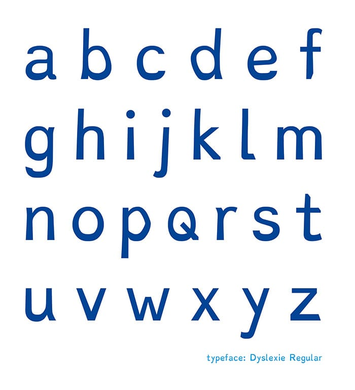
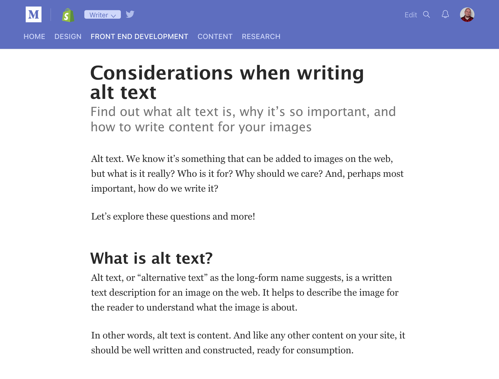
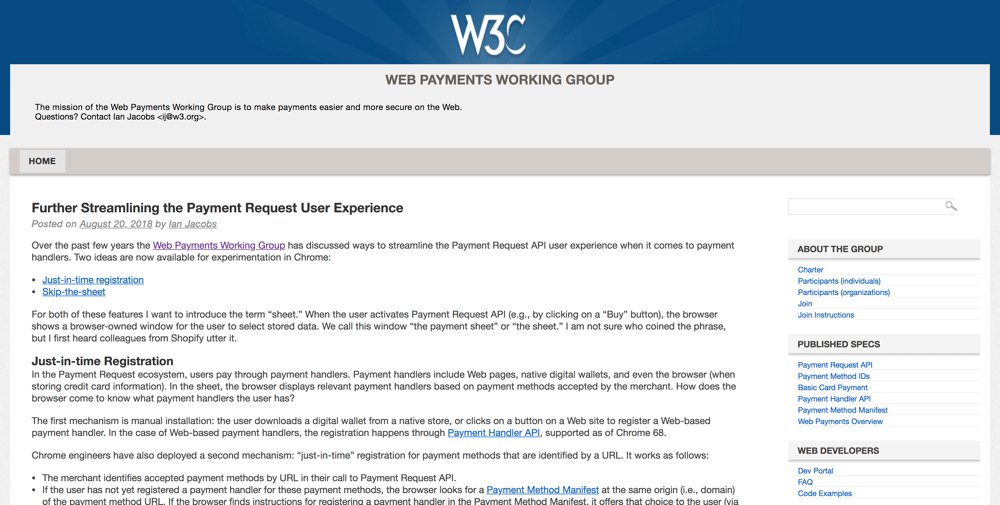
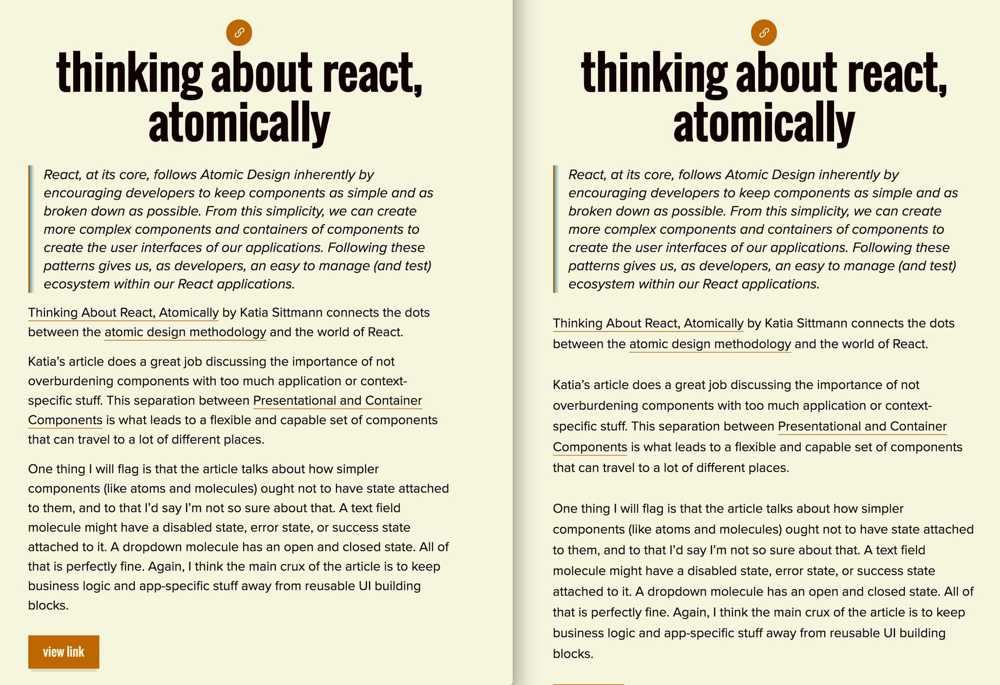

# Content is also design

Why do people visit your site? What keeps them coming back for more? Most likely its a result of high quality content. Content makes up the essence of the web and why people spend so much of their day there. As a result, content itself needs to be well designed in order to create a comfortable user experience.

Not all users of the web have received the same amount of education in their lifetime. Some of us read at different levels and at different speeds. Those with a **learning disability** may have difficulty reading and comprehending content which is full of jargon, acronyms, and other complexities.

How then, do we continue to write quality content that is both informative and inclusive to meet the needs of our readers?

In order to ensure content is readable and understandable by as many people as possible, consider testing your content readability with the Hemingway app. This handy utility app will read your content and make recommendations based on how difficult it might be for someone to read and comprehend. Some of the recommendations include:

- Considerations when using adverbs
- Use of passive voice
- Complexity of phrases
- Difficulties in sentence comprehension

By running your content through this utility, you will end up restructuring your content to better suit a more general audience. The recommended reading level for inclusive content is usually 7th or 8th grade reading level. The Hemingway app will let you know how your content measures up with this requirement.

## Designing for Dyslexia

Someone with **Dyslexia**, which is a disability that impairs a person's fluency or accuracy in being able to read, write, and spell, may have difficulty reading the content on screen.

There are a few design considerations for making text itself readable for folks with Dyslexia. The following are things to **avoid** when designing content:

- **Justified text.** Text which is fully justified can cause dyslexic readers to repeatedly lose their place when reading. To avoid this frustration, always left align text (or right align, depending on your region.)
- **High contrast.** Text which is styled to be pure black (`#000000`) against pure white (`#ffffff`) can generate a high contrast reading environment. As a result, some dyslexic users may experience words to swirl or blur together.
- **Italicized content.** Use of italicized text can actually result in a poor reading experience for people with Dyslexia as a result of the slanted nature and extra pixelation of letter shapes. Use sparingly!
- Consider offering Dyslexie font as an option — Dyslexie is a soecialized font face to help readers with dyslexia.

## Font size

Throughout the late 1990s and early 2000s, websites had body text anywhere between `9px` and `14px`. During this period designers only had to worry about 10” to 19” screen sizes for desktop computer.

Fast forward to around 2011, designers now had a massive plethora of screen sizes, orientations, and viewing lengths to consider. With the mass adoption of Responsive Web Design, these smaller font sizes did not work well on smaller, handheld devices. The new baseline font size became `16px` and hasn’t changed much since.

### Font size and accessibility

Let’s consider a few reasons how larger font sizes increase the accessibility for any site.

- **Readability**: Larger font sizes equates to increased readability. This makes for an easier reading experience for folks with low-vision, including older generations who usually require larger font on any UI due to eyesight deterioration. Bumping up the font size on any site by a few pixels greatly helps with readability.
- **Usability:** Larger fonts means less content required to fill available space in a design. Less content means less cognitive load on readers. Less content required also means being precise and direct when writing content, meeting the requirement of lowering the reading level, which in turn, increases readership and user base as a whole.
- **Scannability:** It’s quite common for people to quickly scan a page of content just to get a feel for what the page has to offer. With larger font sizes, especially headings when they’re designed and used in a visual hierarchy, this increases the scannability of content. The benefit again is to lower cognitive load. And on the flip side of the age equation, younger generations tend to have less patients and attention, therefore scannability is key to getting your message across to younger readers.

> Larger font size means less screen clutter which generates a clearer reading path and more of what people want; content.

Larger font size means less screen clutter which generates a clearer reading path and more of what people want; content.

## More design considerations

A few other things to consider when designing for text:

- Line length
- Line height
- Text zoom

### Line length

Optimal line length is typically between 55 to 75 or 80 characters per line. By limiting the width or horizontal span of content, users will experience less fatigue when scanning from right-to-left in search of the next line of content.

On the other hand, lines which are too short often force an awkward word break, resulting in reading difficulty. Be sure to test your UI in various situations and languages (if supported) to make sure line length isn’t too long or too short.

### Line height

Setting a line height affects the space inbetween lines of content. There’s no “optimal” setting per se, as this depends on the intended design and the font-face in use.

What’s important to note is a new WCAG SC introduced in 2.1: 1.4.12 Text Spacing. This states that when the user overrides the line height to improve their reading experience, no loss of content or functionality will occur when set to at least 1.5 times the font size.

In other words, design to allow for greater line height than intended in the original design and make sure content is still readable.

### Text zoom

One other WCAG SC that’s important to consider when designing typography is 1.4.4 Resize text. This states that someone should be able to resize text up to 200% without loss of content or functionality.

In other words, allow for text and content containers to grow organically in size when text is resized. In CSS, static sizing units such as `px` are to be avoided. Whenever possible, use flexible units like `%`, `em`, or `rem`.

It’s also worth noting that text resize as referenced by this WCAG SC is different than the browser default zoom. Modern browsers today will zoom in using the viewport, essentially using CSS media queries to resize and align content. When the viewport is zoomed in far enough, you might see mobile styles and layout.

This is different than zooming by text alone, which only enlarges text an nothing else. To test for this, use Firefox text zoom option, or a browser extension with your preferred browser.

### ✅ [1.4.4 Resize text](https://www.w3.org/WAI/WCAG21/Understanding/resize-text.html)

This comes back to 1.4.4 Resize text which states

> "Except for captions and images of text, text can be resized without assistive technology up to 200 percent without loss of content or functionality."

## Image alt text

`alt` text, or "alternative text" as the long-form name suggests, is a written text description for an image on the web. It helps to describe the image for the reader to understand what the image is about.

In other words, `alt` text is content. And like any other content on your site, it should be well written and constructed, ready for consumption.

There are a few situations where writing `alt` text and including well formed descriptions for your imagery is beneficial for a successful website, including search engine optimization and sighted users who are able to read the content when and if an image fails to load. However, it is actually people who use and rely on assistive technology who have the most to gain when interacting with non-text content on the web.

`alt` text provides people with **visual impairments** the ability to participate in consuming non-text content. When assistive technology, such as a screen reader, encounters an image on the web, the `alt` text is read and announced aloud. By doing so, someone who relies on this technology can still have a clear understanding of what the image represents and be included in the conversation.

## When to include `alt` text

You might be tempted to always include some sort of text within the `alt` attribute. However, the fact remains that not every image should have a value set for its `alt` attribute.

How do we know when to include `alt` text for our images? Here are three common situations to consider if `alt` text should be added or if the `alt` attribute should be set as empty.

1. If the image itself contains text, such as a logo or an inspirational quote embedded within the image, the `alt` attribute value should be an exact match of the visible text.
2. If the image doesn’t add any valuable content to the article, or is adjacent to related text content, the `alt` attribute value should be left empty. This results in screen readers bypassing the image altogether as it is considered a "decorative" image.
3. If the image is considered to add content or value to the article, add descriptive `alt` text.

There are more examples and situations to consider. For a more comprehensive list, check out the tutorial, "An `alt` Decision Tree" linked in the notes.

### How to write `alt` text

Writing high quality, descriptive `alt` text may not be as easy as it seems. A quick one-liner of "Cat on couch," "white shoes," or "group of people," doesn’t quite do the trick of painting a mental picture.

On the flip side, it is possible to overwhelm someone with too much descriptive text. Getting that fine line of descriptive precision is something of a skill master.

As a test, let’s write some `alt` text for this image:

For this image, an accurate description might be something like:

> "A pair of low-top shoes are placed on top of a dark-brown table in front of a white brick wall. The shoes are mostly dark blue with a white midsole, brown laces, a black back tab, and white lining."

This description is pretty accurate, but a little too wordy. Since we’re describing a product we can focus directly on the product’s physical features.

Let’s cut the description back to just the essential, such as:

> "Dark blue, low-top shoes with white midsole, brown lace, black back tab, and white lining."

This `alt` text does the trick; it describes the image in a clear and precise manner, not overwhelming someone as they take in the content. The general recommendation is to keep `alt` text to around 100 characters in order to hit that fine line of "just enough" content.

### ✅ [1.1.1 Non-text Content](https://www.w3.org/WAI/WCAG21/Understanding/non-text-content.html)

This comes back to 1.1.1 Non-text Content which states

> "All non-text content that is presented to the user has a text alternative that serves the equivalent purpose."
